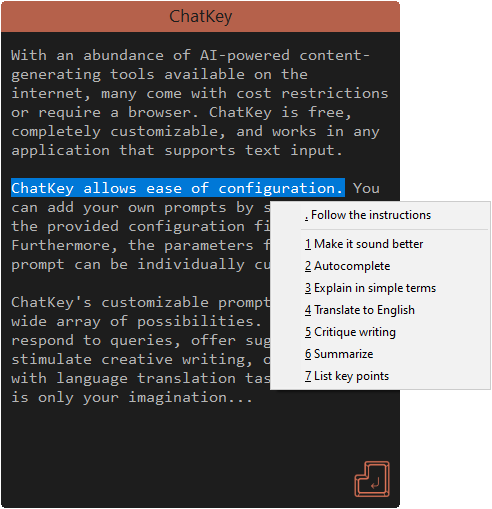

<p align="center"></p>

<p align="center">
  <a href="https://opensource.org/licenses/MIT">
    
  </a>
  <a href="https://github.com/overflowy/chat-key/releases/latest">
    
  </a>
  <a href="https://github.com/overflowy/chat-key/releases/latest">
    
  </a>
  <a href="https://www.autohotkey.com">
    
  </a>
</p>

## About

ChatKey is small tool that enables you to use your own ChatGPT/GPT-4 prompts in any application that supports text input.

<p align="center">
  <a href="https://github.com/overflowy/chat-key/releases/latest">
    
  </a>
</p>

## Usage

1. Please ensure that you have configured the OPENAI_TOKEN environment variable with your API key
2. Download the latest release from the [releases](https://github.com/overflowy/chat-key/releases/latest) page
3. Extract all files from the zip
4. Run `ChatKey.exe`
5. Start typing in any application that supports text input
6. Select the text to use as input for the prompt
7. Press the hotkey to show the popup menu (default: `Alt + .`).
8. Select the prompt from the popup menu
9. Wait for the response to be generated
10. Review the generated response and press `Enter`

## Configuration

To configure ChatKey, simply edit the `config.ini` file provided.

### Basic settings

| Key                 | Description                                          | Default   |
| ------------------- | ---------------------------------------------------- | --------- |
| `popup_menu_hotkey` | The hotkey to show the popup menu                    | `Alt + .` |
| `replace_text`      | Whether to replace the selected text with the prompt | `0`       |

*More settings will be added in future releases.

### Adding prompts

To add new prompts, simply include a new section in the `config.ini` file. For instance, if you wish to include a prompt for translating text to Italian, you can achieve this by appending the following section to the configuration file:

```ini
[prompt_translate_to_italian]
name = Translate to Italian
shortcut = t
system_prompt = "I want you to act as an Italian translator. I will say something in any language and you will translate it to Italian. The first thing I want you to translate is:"
temperature = 0.2
model = gpt-3.5-turbo
```

To ensure that the newly added prompt is available in the popup menu, it is necessary to include it in the `[popup_menu]` section. Additionally, if you have already configured multiple prompts, you can tidy up the popup menu by utilizing `---` as a separator.

```ini
[popup_menu]
---
prompt_translate_to_italian
```

The changes will be applied automatically, there's no need to restart ChatKey (the only exception to this rule is the global `popup_menu_hotkey`).

### Prompt settings

You can individually configure the parameters of each prompt. If keys with default values are omitted, the default values will be used instead.

| Key             | Description                                                                                              | Default   |
| --------------- | -------------------------------------------------------------------------------------------------------- | --------- |
| `name`          | The name of the prompt that will be displayed in the popup menu                                          |           |
| `shortcut`      | The shortcut key to select the prompt from the popup menu                                                |           |
| `system_prompt` | The prompt that will be used to generate the response                                                    |           |
| `temperature`   | The temperature to use when generating the response (0.0 - 1.0)                                          | `0.7`     |
| `model`         | The model to use when generating the response, more info [here](https://platform.openai.com/docs/models) | `gpt-3.5` |

*More parameters will be included in future releases.

## Acknowledgements

- [cocobelgica](https://github.com/cocobelgica) for the JSON lib
